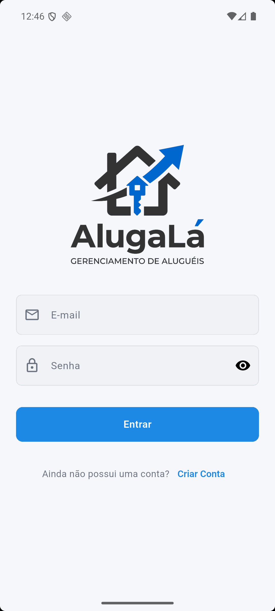
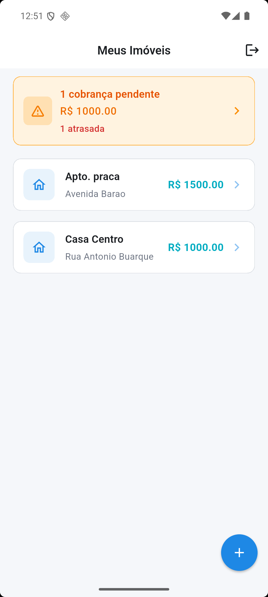
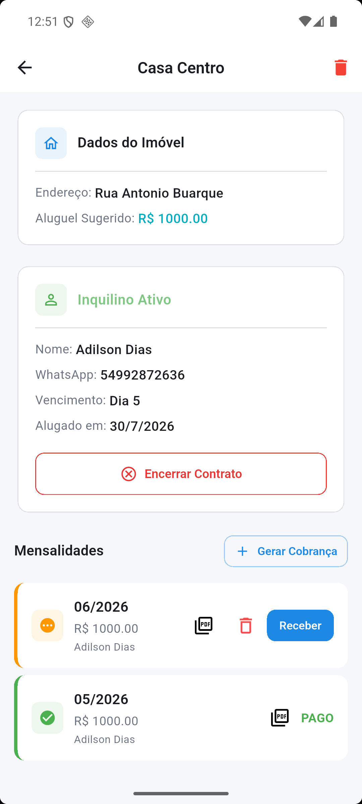
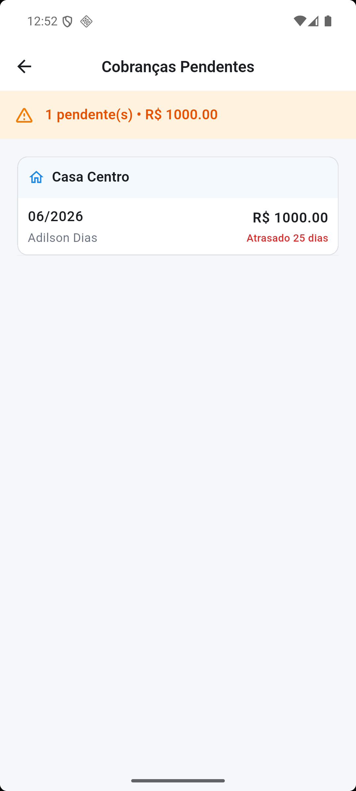
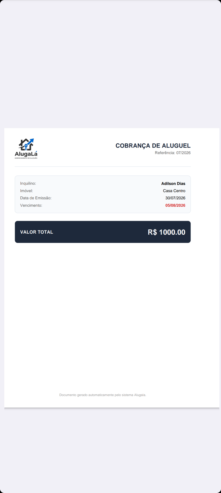

# AlugaLá

App para acompanhar o pagamento de aluguéis de forma simples e centralizada.

Criado para eliminar anotações em papel: você registra imóveis, locações e mensalidades em um só lugar, acompanha o que está pendente e gera cobranças com mais organização.

---

## Sobre o projeto

O **AlugaLá** ajuda proprietários e gestores a:

- Ter visão clara dos imóveis e valores
- Acompanhar locações e inquilinos
- Controlar mensalidades pagas e pendentes
- Centralizar cobranças sem depender de cadernos ou planilhas soltas

---

## Funcionalidades

- **Autenticação** — login e cadastro de usuário
- **Imóveis** — cadastro, listagem e detalhes (apelido, endereço, valor base)
- **Locações** — vínculo do imóvel com inquilino, dia de vencimento e status
- **Mensalidades** — controle de pagamentos por mês/ano de referência
- **Cobranças pendentes** — visão agrupada do que ainda não foi pago
- **Geração de PDF** — documento de cobrança para envio ou impressão

---

## Screenshots

| Tela | Preview |
|------|---------|
| Login |  |
| Dashboard / Meus Imóveis |  |
| Detalhes do imóvel |  |
| Cobranças pendentes |  |
| PDF de cobrança |  |

---

## Tecnologias

| Tecnologia | Uso |
|------------|-----|
| [Flutter](https://flutter.dev/) | App mobile |
| [Supabase](https://supabase.com/) | Backend, autenticação e banco de dados |
| [pdf](https://pub.dev/packages/pdf) + [printing](https://pub.dev/packages/printing) | Geração e impressão de cobranças em PDF |
| [flutter_dotenv](https://pub.dev/packages/flutter_dotenv) | Variáveis de ambiente |

---

## Como rodar

### Pré-requisitos

- Flutter SDK instalado
- Conta e projeto no Supabase
- Arquivo de ambiente configurado em `assets/.env`

### Passos

```bash
# 1. Clonar o repositório
git clone <url-do-repositorio>
cd alugala

# 2. Instalar dependências
flutter pub get

# 3. Configurar o .env (em assets/.env)
# SUPABASE_URL=sua_url
# SUPABASE_ANON_KEY=sua_chave

# 4. Executar o app
flutter run